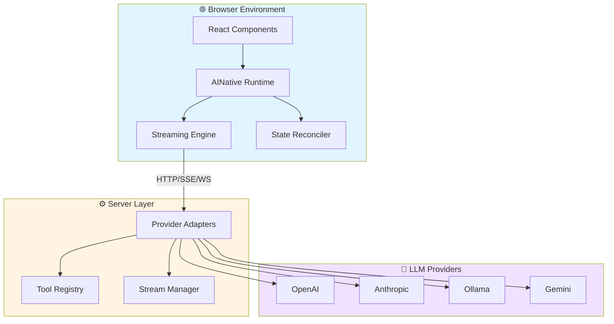

<div align="center">

# 🤖 AINative

### **The AI-Native Frontend Framework**

*Build intelligent, LLM-powered applications with React-like simplicity*

[](./LICENSE)
[](https://www.npmjs.com/package/@ainative/client)
[](https://www.typescriptlang.org/)
[](https://nodejs.org/)
[](https://pnpm.io/)

[](https://github.com/hari7261/ainative/stargazers)
[](https://github.com/hari7261/ainative/network/members)
[](https://github.com/hari7261/ainative/issues)
[](./CONTRIBUTING.md)

<p align="center">
  <a href="#-features">Features</a> •
  <a href="#-quick-start">Quick Start</a> •
  <a href="#-architecture">Architecture</a> •
  <a href="#-documentation">Documentation</a> •
  <a href="#-examples">Examples</a> •
  <a href="#-contributing">Contributing</a>
</p>

---

</div>

## 🌟 Overview

**AINative** is a revolutionary, production-ready framework that brings **AI-first development** to the frontend. Instead of writing complex imperative UI logic, you let language models intelligently control your application state while you focus on crafting exceptional user experiences.

> 💡 **The Future of UI Development**: Let AI handle the complexity, you handle the creativity.

<br/>

## ✨ Features

<table>
<tr>
<td width="50%">

### 🤖 **AI-Driven State Management**
Let Large Language Models directly control your application state with intelligent decision-making.

### 🌊 **Real-time Streaming**
Native support for token-by-token updates via SSE and WebSocket protocols for fluid user experiences.

### ⚛️ **React Compatible**
Built on familiar React patterns - no need to learn a new paradigm, just enhance what you know.

### 🔌 **Universal Provider Support**
Seamlessly integrate with OpenAI, Anthropic, Ollama, Google Gemini, and more providers.

</td>
<td width="50%">

### 🎬 **Multimodal by Default**
First-class support for text, audio, images, and file inputs out of the box.

### ⚡ **Lightning-Fast DX**
Powered by Vite and modern tooling for instant hot-reload and blazing-fast builds.

### 🛠️ **Powerful Tool System**
Enable LLMs to execute functions, call APIs, and interact with external systems safely.

### 📦 **Monorepo Architecture**
Everything you need in one place: client runtime, server adapters, CLI, and examples.

</td>
</tr>
</table>

<br/>

## 🚀 Quick Start

### Installation

Get started in seconds with our CLI tool:

```bash
npm install -g @ainative/cli
```

### Create Your First Project

```bash
# Initialize a new AINative project
ainative init my-app

# Navigate to your project
cd my-app

# Install dependencies
npm install
```

### Configure Your API Key

Create a `.env` file in your project root:

```bash
# OpenAI (default)
OPENAI_API_KEY=sk-your-key-here

# Or use Anthropic
ANTHROPIC_API_KEY=your-anthropic-key

# Or use Ollama (local)
OLLAMA_BASE_URL=http://localhost:11434
```

### Launch Your App

```bash
# Terminal 1: Start the AI backend server
npm run server

# Terminal 2: Start the development server
npm run dev
```

🎉 **That's it!** Visit `http://localhost:5173` and start building!

<br/>

## 💡 Quick Example

Build a fully functional AI chat interface in just a few lines:

```tsx
import { AIAppComponent, AIPane } from '@ainative/client';

function App() {
  const config = {
    apiUrl: 'http://localhost:3001',
    streamMethod: 'SSE' as const,
  };

  return (
    <AIAppComponent config={config}>
      {(state, app) => (
        <AIPane
          state={state}
          onSendMessage={(msg) => app.sendMessage(msg)}
          title="AI Assistant"
        />
      )}
    </AIAppComponent>
  );
}
```

**That's all you need!** The AI handles state management, streaming, and responses automatically.

<br/>

## 🏗️ Architecture

<div align="center">



</div>

### How It Works

1. **🎨 Frontend Layer**: React components interface with AINative's runtime
2. **🔄 Streaming Engine**: Manages real-time token streaming via SSE/WebSocket
3. **🧠 State Reconciler**: Keeps UI in sync with AI-generated state updates
4. **🔌 Server Adapters**: Abstract away provider-specific implementations
5. **🤖 LLM Providers**: Connect to OpenAI, Anthropic, Ollama, or custom providers

<br/>

## 📦 Packages

<table>
<tr>
<td align="center" width="25%">

<br/><br/>
<strong>@ainative/client</strong>
<br/>
<sub>React runtime & components</sub>
<br/>
<a href="./packages/client">📖 Docs</a>
</td>

<td align="center" width="25%">

<br/><br/>
<strong>@ainative/server-node</strong>
<br/>
<sub>Node.js server adapter</sub>
<br/>
<a href="./packages/server-node">📖 Docs</a>
</td>

<td align="center" width="25%">

<br/><br/>
<strong>@ainative/server-python</strong>
<br/>
<sub>Python server adapter</sub>
<br/>
<a href="./packages/server-python">📖 Docs</a>
</td>

<td align="center" width="25%">

<br/><br/>
<strong>@ainative/cli</strong>
<br/>
<sub>Command-line tool</sub>
<br/>
<a href="./packages/cli">📖 Docs</a>
</td>
</tr>
</table>

<br/>

## 🛠️ Technology Stack

<div align="center">

| Category | Technologies |
|----------|-------------|
| **Frontend** |    |
| **Backend** |    |
| **AI/LLM** |    |
| **Build Tools** |    |
| **Testing** |   |

</div>

<br/>

## 📚 Documentation

<div align="center">

| 📖 Guide | 📝 Description |
|---------|---------------|
| [Getting Started](./docs/getting-started.md) | Complete beginner's guide to AINative |
| [Installation](./docs/installation.md) | Detailed installation instructions |
| [Architecture](./docs/architecture.md) | Deep dive into framework architecture |
| [Component API](./docs/component-api.md) | React component reference |
| [Server API](./docs/server-api.md) | Server-side API documentation |
| [Streaming](./docs/streaming.md) | Real-time streaming implementation |
| [Tools & Actions](./docs/tools-and-actions.md) | Build custom AI tools and actions |
| [CLI Reference](./docs/cli.md) | Command-line interface guide |

</div>

<br/>

## 🎯 Use Cases

<table>
<tr>
<td width="33%">

### 💬 **Conversational Interfaces**
Build intelligent chatbots and assistants with natural language understanding and context-aware responses.

</td>
<td width="33%">

### 📊 **Data Analysis Tools**
Create AI-powered dashboards that analyze and visualize data based on natural language queries.

</td>
<td width="33%">

### 🎨 **Creative Applications**
Develop content generation tools, design assistants, and creative AI companions.

</td>
</tr>
<tr>
<td width="33%">

### 🛒 **E-commerce Assistants**
Build smart shopping assistants that help users find products and make decisions.

</td>
<td width="33%">

### 📝 **Document Processors**
Create intelligent document analysis and generation tools with multimodal support.

</td>
<td width="33%">

### 🎓 **Educational Tools**
Develop interactive learning platforms with AI tutors and personalized education.

</td>
</tr>
</table>

<br/>

## 🎨 Examples

Explore our example projects to see AINative in action:

<table>
<tr>
<td width="50%">

### 💬 [Basic Chat](./examples/basic-chat)
A simple, clean chat interface demonstrating core AINative features:
- Real-time AI responses
- Message streaming
- Basic state management

**Perfect for**: Getting started and understanding fundamentals

</td>
<td width="50%">

### 🌊 [Streaming Demo](./examples/streaming-demo)
Advanced streaming features and capabilities:
- SSE and WebSocket support
- Token-by-token rendering
- Error handling and recovery

**Perfect for**: Production-ready implementations

</td>
</tr>
</table>

<br/>

## 🗺️ Roadmap

<details>
<summary><strong>Click to see our exciting roadmap!</strong></summary>

<br/>

### 🚀 Version 0.2.0 (Q2 2026)
- [ ] Enhanced multimodal capabilities (video support)
- [ ] Advanced caching and performance optimizations
- [ ] Plugin system for custom integrations
- [ ] Improved developer tools and debugging

### 🎯 Version 0.3.0 (Q3 2026)
- [ ] Visual UI builder for AI interfaces
- [ ] Pre-built template library
- [ ] Advanced analytics and monitoring
- [ ] Cloud deployment helpers

### 🌟 Future Plans
- [ ] Mobile SDK (React Native support)
- [ ] Voice interface components
- [ ] Collaborative AI features
- [ ] Enterprise features and SLA

</details>

<br/>

## 🔧 Development

### Prerequisites

Before you begin, ensure you have the following installed:

- **Node.js** >= 18.0.0
- **pnpm** >= 8.0.0
- **Python** >= 3.10 (for Python server adapter)
- **Git**

### Setup

Clone and set up the repository:

```bash
# Clone the repository
git clone https://github.com/hari7261/ainative.git
cd ainative

# Install dependencies
pnpm install
```

### Build All Packages

```bash
pnpm build
```

### Run Tests

```bash
# Run all tests
pnpm test

# Run unit tests only
pnpm test:unit

# Run E2E tests
pnpm test:e2e
```

### Development Workflow

```bash
# Run all packages in development mode
pnpm dev

# Lint code
pnpm lint

# Format code
pnpm format
```

### Run Example Applications

```bash
# Navigate to an example
cd examples/basic-chat

# Install dependencies
pnpm install

# Terminal 1: Start the AI backend server
pnpm run server

# Terminal 2: Start the development server
pnpm run dev
```

<br/>

## 🤝 Contributing

We love contributions! AINative is a community-driven project and we welcome contributions of all kinds.

<div align="center">

[](https://github.com/hari7261/ainative/graphs/contributors)
[](https://github.com/hari7261/ainative/pulls)
[](https://github.com/hari7261/ainative/commits)

</div>

### Ways to Contribute

- 🐛 **Report Bugs** - Found a bug? [Open an issue](https://github.com/hari7261/ainative/issues/new)
- 💡 **Suggest Features** - Have an idea? We'd love to hear it!
- 📝 **Improve Documentation** - Help make our docs better
- 🔧 **Submit Pull Requests** - Fix bugs or add new features
- ⭐ **Star the Project** - Show your support!

### Getting Started

1. Fork the repository
2. Create your feature branch (`git checkout -b feature/amazing-feature`)
3. Commit your changes (`git commit -m 'feat: add amazing feature'`)
4. Push to the branch (`git push origin feature/amazing-feature`)
5. Open a Pull Request

For detailed guidelines, see [CONTRIBUTING.md](./CONTRIBUTING.md)

<br/>

## 📄 License

<div align="center">

**MIT License** © [AINative Contributors](./LICENSE)

This project is free and open-source software licensed under the MIT License.
<br/>See the [LICENSE](./LICENSE) file for details.

</div>

<br/>

## 🌐 Community & Support

<div align="center">

| Platform | Link |
|----------|------|
| 💬 **GitHub Discussions** | [Join the conversation](https://github.com/hari7261/ainative/discussions) |
| 🐛 **GitHub Issues** | [Report bugs & request features](https://github.com/hari7261/ainative/issues) |
| 📧 **Email** | support@ainative.dev |
| 🐦 **Twitter** | [@AINativeJS](https://twitter.com/AINativeJS) |

</div>

<br/>

## 🙏 Acknowledgments

AINative is built with the help of these amazing technologies and communities:

- [React](https://react.dev/) - The UI library we build upon
- [Vite](https://vitejs.dev/) - Lightning-fast build tool
- [OpenAI](https://openai.com/) - Leading AI provider
- [Anthropic](https://anthropic.com/) - Advanced AI research
- [Ollama](https://ollama.ai/) - Local LLM runtime
- All our [contributors](https://github.com/hari7261/ainative/graphs/contributors) 💙

<br/>

## 📊 Project Stats

<div align="center">


[](https://star-history.com/#hari7261/ainative&Date)

</div>

<br/>

---

<div align="center">

### ⭐ Star us on GitHub — it motivates us a lot!

**Built with ❤️ by the [AINative Community](https://github.com/hari7261/ainative)**

<sub>Made with 🤖 for developers who want to build the future of AI-powered UIs</sub>

[](https://github.com/hari7261/ainative)
[](https://github.com/hari7261/ainative)

</div>
